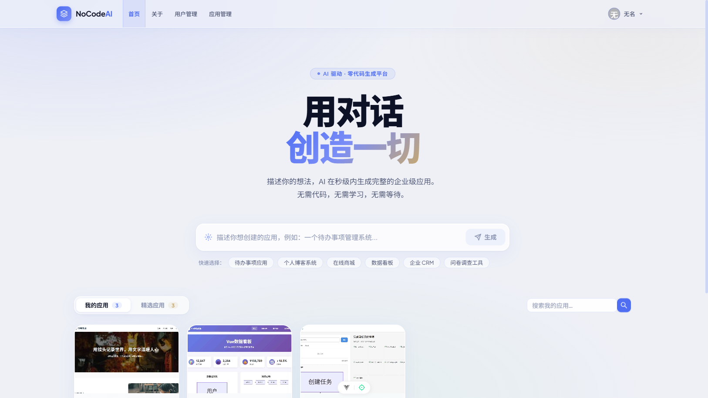
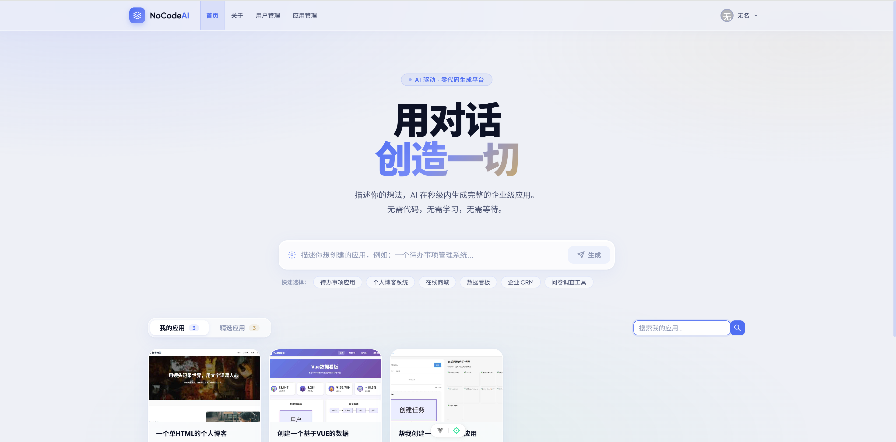
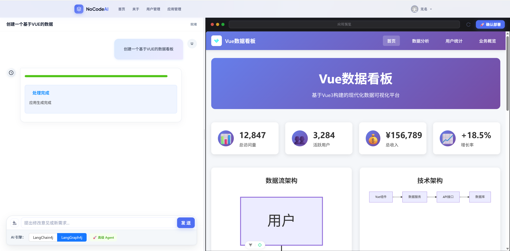
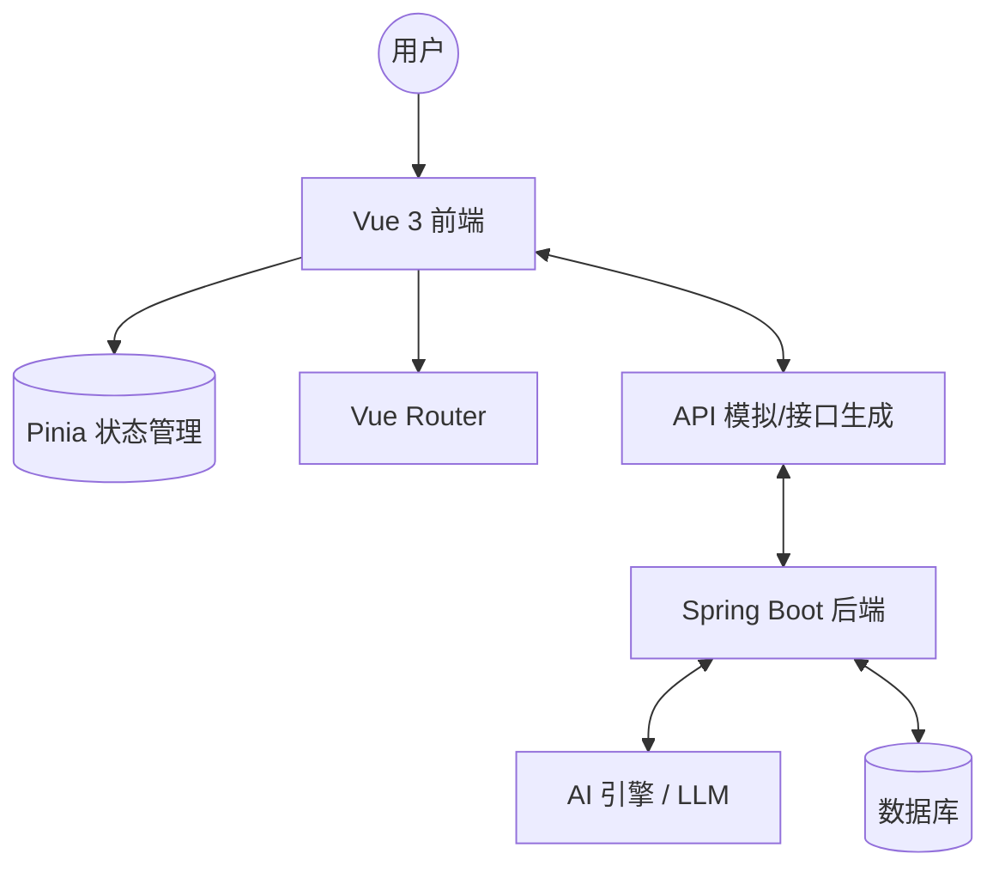

# NoCode AI: 企业级无代码应用生成平台 🚀

[](LICENSE)
[](https://vuejs.org/)
[](https://www.antdv.com/)

NoCode AI 是一个由人工智能驱动的先进无代码开发平台。它旨在打破技术壁垒，让任何人都能通过简单的自然语言描述，在几秒钟内生成功能完备、设计精美的企业级应用。

---

## 📋 1. 项目介绍

**NoCode AI** 不仅仅是一个生成工具，它是一个完整的生态系统，涵盖了从构思到部署的全流程。

- **愿景**：让软件开发像对话一样简单。
- **定位**：初创企业、非技术创始人和企业数字化转型的高效生产力工具。
- **核心竞争力**：极速生成、拟物化设计、前后端自动打通、开箱即用。

后端项目：[NoCodePlatform]: https://github.com/qasax/NoCodePlatform/tree/master

---

## ✨ 2. 功能介绍

### 核心功能

- 🤖 **AI 对话驱动**：输入文字描述，AI 自动解析需求并生成应用。
- 🎨 **现代视觉设计**：采用流体拟物化（Neumorphism）设计语言，体验极佳。
- 📦 **应用全生命周期管理**：支持应用的创建、预览、编辑、发布与删除。
- 👤 **精细化用户权限**：内置管理员与普通用户角色，包含完整的鉴权体系。
- 🔍 **精选应用展示**：优质应用一键置顶，形成社区模板参考。

### 界面展示

|     首页看板      |                        应用部署                         |                          应用生成                           |
| :---------------: | :-----------------------------------------------------: | :---------------------------------------------------------: |
|  |  |  |

---

## 🏗️ 3. 技术架构

项目采用了现代化的微服务思维进行前端解耦设计。



### 技术栈选型

- **框架**：Vue 3 (Composition API)
- **构建工具**：Vite 7
- **UI 组件库**：Ant Design Vue 4
- **状态管理**：Pinia
- **网络请求**：Axios (支持 SSE 流式返回)
- **API 自动生成**：openapi2ts (后端接口一键同步)

---

## 🔄 4. 工作流设计

1. **需求输入**：用户通过首页搜索框输入应用的功能描述（例如：“帮我做一个在线商城”）。
2. **AI 解析**：前端发起请求，后端调用大语言模型生成应用基础骨架、数据库 Schema 及 UI 配置。
3. **实时生成**：通过 SSE（Server-Sent Events）将生成过程实时推送至前端，实现“可见即所得”。
4. **自动化部署**：生成结束后，系统自动分配临时访问地址，应用即刻上线。
5. **管理维护**：用户可在“应用管理”中进一步精修或维护生成的应用。

---

## 🚀 5. 快速开始

### 环境依赖

- **Node.js**: `^20.19.0` 或更高版本
- **包管理器**: `npm` 指令

### 本地部署步骤

1. **克隆项目**

   ```bash
   git clone https://github.com/your-repo/NoCodePlatform-frontend.git
   cd NoCodePlatform-frontend
   ```

2. **安装依赖**

   ```bash
   npm install
   ```

3. **配置环境变量**
   在根目录创建 `.env` 文件：

   ```env
   VITE_BACKEND_URL=http://localhost:8790
   ```

4. **启动开发服务器**
   ```bash
   npm run dev
   ```
   默认访问地址：`http://localhost:5173`

---

## 📁 6. 项目结构

```text
/src
 ├── api/               # [自动生成] 后端 Swagger 接口的服务与类型定义
 ├── assets/            # 静态资源、Logo 及拟物化设计变量
 ├── components/        # 公共组件 (GlobalHeader, GlobalFooter 等)
 ├── layouts/           # 页面布局模板 (BasicLayout, UserLayout)
 ├── router/            # 路由配置与全局导航守卫 (权限拦截)
 ├── stores/            # Pinia 数据中心 (用户状态、应用配置)
 ├── views/             # 核心业务视图
 │    ├── admin/        # 管理员专属：用户管理等
 │    ├── app/          # 应用管理：列表、预览、构建详情
 │    ├── user/         # 分账户系统：登录、注册
 │    └── HomeView.vue  # 现代化拟物风首页
 ├── App.vue            # 应用根节点
 ├── main.ts            # 全局模块挂载入口
 └── request.ts         # Axios 封装与全局拦截器
```

---

## 🔍 7. 核心设计

### 响应式全局状态

利用 **Pinia** 实现了单向数据流方案，确保 `loginUser` 等核心状态在多端路由跳转后依然保持高一致性。

### 接口契约自动化

借力 `openapi2ts` 工具链，将后端 `RESTful API` 的变更实时映射到前端 `TypeScript` 类型，大幅降低协作摩擦。

### 流体拟物化 UI 系统

全局样式深度定制了基于 HSL 调色板的拟物化原子类，通过对 `box-shadow` 和 `backdrop-filter` 的极致运用，营造了极佳的视觉深度。

---

## 🛣️ 8. Roadmap

- [x] 基于 Vue 3 的企业级脚手架搭建
- [x] 全局路由拦截与多角色权限验证
- [x] 拟物化风格 UI 组件深度定制
- [x] 集成 SSE 流式实时推送机制
- [ ] 🧩 在线模版市场与行业级插件
- [ ] 📱 移动端自适应与跨端方案集成
- [ ] ☁️ 企业私有化部署一键生成器

---

## 🤝 9. 贡献

我们非常欢迎来自社区的贡献！

1. 在提交 PR 之前，请先开启一个 `Issue` 讨论您的想法。
2. 遵循代码风格规范，确保通过 `npm run lint`。
3. 提交 `Pull Request` 时请详细填写变更日志。

---

## 📄 10. License

本项目基于 [MIT License](LICENSE) 协议开源。

---

Made with ❤️ by NoCodeAI Open Source Team
