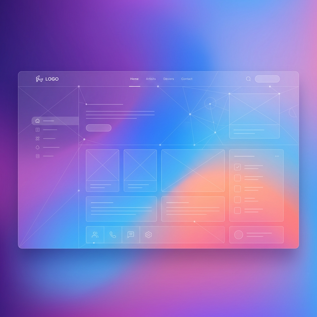
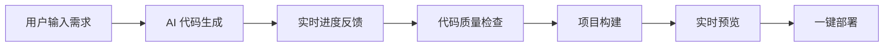

# NoCode AI Platform - 无代码 AI 应用生成平台

<p align="center">
  
</p>

<p align="center">
  <strong>用对话创造一切 —— AI 驱动的零代码应用生成平台</strong>
</p>

<p align="center">
  <a href="#特性">特性</a> •
  <a href="#技术栈">技术栈</a> •
  <a href="#快速开始">快速开始</a> •
  <a href="#项目结构">项目结构</a> •
  <a href="#核心功能">核心功能</a> •
  <a href="#api文档">API文档</a>
</p>

---

## ✨ 特性

- 🤖 **AI 驱动代码生成** - 基于大语言模型，通过自然语言描述自动生成完整的企业级应用
- 💬 **交互式对话开发** - 支持多轮对话，持续优化和修改生成的应用
- 🎨 **可视化元素编辑** - 支持在预览页面直接选中元素进行精准修改
- 🖥️ **实时预览** - 应用生成过程中实时预览效果，所见即所得
- 📱 **响应式设计** - 生成的应用自动适配多种设备尺寸
- 🚀 **一键部署** - 应用开发完成后一键部署，立即上线
- 🔄 **SSE 实时流** - 基于 Server-Sent Events 的实时进度反馈
- 🛡️ **持久化连接** - 支持页面刷新后自动恢复 SSE 连接和任务状态

## 🛠️ 技术栈

### 核心框架
- **Vue 3** - 渐进式 JavaScript 框架，采用 Composition API
- **TypeScript** - 类型安全的 JavaScript 超集
- **Vite** - 下一代前端构建工具，极速冷启动

### 状态管理与路由
- **Vue Router 5** - 官方路由管理器，支持动态路由和权限守卫
- **Pinia** - Vue 官方推荐的状态管理方案

### UI 组件库
- **Ant Design Vue 4** - 企业级 UI 组件库
- **@ant-design/icons-vue** - 图标库

### 代码生成与展示
- **marked** - Markdown 解析器，用于渲染 AI 回复内容
- **highlight.js** - 语法高亮库
- **md-editor-v3** - Markdown 编辑器组件

### 网络与数据处理
- **Axios** - HTTP 客户端
- **json-bigint** - 处理大整数精度问题

### 开发工具
- **ESLint + Prettier** - 代码规范与格式化
- **oxlint** - 高性能 JavaScript 检查器
- **TypeScript** - 静态类型检查
- **Vite DevTools** - Vue 开发调试工具

## 🚀 快速开始

### 环境要求
- Node.js: `^20.19.0 || >=22.12.0`
- npm 或 yarn

### 安装依赖

```bash
npm install
```

### 开发环境运行

```bash
npm run dev
```

应用将在 `http://localhost:5173` 启动（默认端口）

### 构建生产版本

```bash
npm run build
```

构建产物将输出到 `dist/` 目录

### 代码检查与格式化

```bash
# 运行所有检查
npm run lint

# 仅运行 ESLint
npm run lint:eslint

# 仅运行 oxlint
npm run lint:oxlint

# 格式化代码
npm run format

# 类型检查
npm run type-check
```

## 📁 项目结构

```
nocodeplatform-frontend/
├── public/                    # 静态资源
├── src/
│   ├── api/                   # API 接口层
│   │   ├── yingyongguanli.ts  # 应用管理接口
│   │   ├── yonghuguanli.ts    # 用户管理接口
│   │   ├── duihualishiguanli.ts # 对话历史接口
│   │   ├── jiankangjiancha.ts   # 健康检查接口
│   │   ├── typings.d.ts       # TypeScript 类型定义
│   │   └── index.ts           # 接口统一导出
│   ├── assets/                # 静态资源
│   │   ├── main.css           # 全局样式
│   │   └── default_cover.png  # 默认封面图
│   ├── components/            # 通用组件
│   │   ├── GlobalHeader.vue   # 全局头部导航
│   │   └── GlobalFooter.vue   # 全局底部
│   ├── composables/           # 组合式函数
│   │   └── useVisualEditor.ts # 可视化编辑能力
│   ├── layouts/               # 布局组件
│   │   ├── BasicLayout.vue    # 基础布局（首页、应用详情等）
│   │   ├── ChatLayout.vue     # 对话布局（应用生成页）
│   │   └── UserLayout.vue     # 用户布局（登录、注册）
│   ├── router/                # 路由配置
│   │   ├── index.ts           # 路由定义与权限守卫
│   │   └── vue-router.d.ts    # 路由类型扩展
│   ├── stores/                # Pinia 状态管理
│   │   └── useLoginUserStore.ts # 登录用户状态
│   ├── views/                 # 页面视图
│   │   ├── HomeView.vue       # 首页（应用列表）
│   │   ├── AppGenerationView.vue  # 应用生成页（核心功能）
│   │   ├── AppDetailView.vue  # 应用详情页
│   │   ├── AppEditView.vue    # 应用编辑页
│   │   ├── AboutView.vue      # 关于页面
│   │   ├── user/              # 用户相关页面
│   │   │   ├── UserLoginView.vue
│   │   │   └── UserRegisterView.vue
│   │   └── admin/             # 管理后台
│   │       ├── UserManageView.vue
│   │       └── AppManageView.vue
│   ├── App.vue                # 根组件（布局切换）
│   ├── main.ts                # 应用入口
│   └── request.ts             # Axios 封装与拦截器
├── dist/                      # 构建产物
├── package.json               # 项目配置
├── tsconfig.json              # TypeScript 配置
├── vite.config.ts             # Vite 配置
└── eslint.config.ts           # ESLint 配置
```

## 🎯 核心功能

### 1. 应用生成流程



### 2. 对话式开发

- **多轮对话** - 支持持续对话优化应用
- **元素级编辑** - 可视化选中页面元素进行精准修改
- **上下文感知** - AI 理解对话历史，提供连贯的开发体验

### 3. SSE 实时通信

- **进度实时展示** - 代码生成各阶段进度实时显示
- **断线重连** - 自动重连机制，指数退避策略
- **状态持久化** - 页面刷新后自动恢复任务状态

### 4. 可视化编辑

- **iframe 元素高亮** - 预览页面元素悬停高亮
- **元素信息提取** - 自动提取选中元素的标签、ID、类名等信息
- **精准修改** - 基于选中元素进行针对性优化

## 🔐 权限管理

| 路由 | 权限 | 说明 |
|------|------|------|
| `/` | 公开 | 首页，应用列表 |
| `/about` | 公开 | 关于页面 |
| `/user/*` | 公开 | 登录、注册 |
| `/app/gen/:appId` | 需登录 | 应用生成页 |
| `/app/detail/:id` | 公开 | 应用详情 |
| `/app/edit/:id` | 需登录 | 应用编辑 |
| `/admin/*` | 需管理员 | 管理后台 |

## 🎨 主题与样式

项目采用 **Crystal Grid** 设计语言：

- **玻璃拟态 (Glassmorphism)** - 半透明背景与模糊效果
- **低饱和度配色** - 舒适的视觉体验
- **模块化设计** - 可复用的组件与样式
- **空间感布局** - 清晰的层级与间距

### 设计令牌

```css
:root {
  /* 品牌色 */
  --c-primary: #4f6ef2;
  --c-primary-hov: #3d5ce8;
  --c-accent: #c8a96e;
  --c-danger: #e05c6b;
  --c-success: #3dbd87;
  
  /* 中性色 */
  --c-bg: #eef0f6;
  --c-text-1: #0d1226;
  --c-text-2: #4a5270;
  --c-text-3: #9099b5;
}
```

## 🔌 API 接口

### 应用管理

| 接口 | 方法 | 说明 |
|------|------|------|
| `/app/add` | POST | 创建应用 |
| `/app/edit` | POST | 编辑应用 |
| `/app/delete` | POST | 删除应用 |
| `/app/get/vo` | GET | 获取应用详情 |
| `/app/my/list/page/vo` | POST | 查询我的应用列表 |
| `/app/list/page/vo` | POST | 查询精选应用列表 |
| `/app/chat/gen/code` | GET | AI 聊天生成代码（SSE） |
| `/app/deploy` | POST | 部署应用 |
| `/app/preview/:appId` | GET | 获取预览地址 |

### 用户管理

| 接口 | 方法 | 说明 |
|------|------|------|
| `/user/register` | POST | 用户注册 |
| `/user/login` | POST | 用户登录 |
| `/user/logout` | POST | 用户登出 |
| `/user/get/login` | GET | 获取当前登录用户 |

### 对话历史

| 接口 | 方法 | 说明 |
|------|------|------|
| `/chat_history/list/page/vo` | POST | 查询对话历史列表 |

## 🧩 扩展开发

### 新增页面

1. 在 `src/views/` 创建视图组件
2. 在 `src/router/index.ts` 注册路由
3. 如需新布局，在 `src/layouts/` 创建布局组件

### 新增接口

1. 在 `src/api/` 创建接口文件
2. 在 `src/api/typings.d.ts` 定义类型
3. 在 `src/api/index.ts` 统一导出

### 新增状态管理

1. 在 `src/stores/` 创建 Pinia store
2. 使用 Composition API 风格编写

## 🐛 调试与开发技巧

### 浏览器调试

```javascript
// 查看当前登录用户状态
console.log(useLoginUserStore().loginUser)

// 查看应用生成状态
console.log(appGenerationView.sseConnection)
console.log(appGenerationView.progressPercentage)
```

### 常见问题

**Q: 页面刷新后 SSE 连接丢失？**  
A: 项目已实现 SSE 状态持久化，刷新页面后会自动重连并恢复任务状态。

**Q: 如何调试可视化编辑功能？**  
A: 在应用生成页点击"可视化编辑"按钮，然后在右侧预览框中悬停和点击元素。

**Q: 构建失败如何处理？**  
A: 先运行 `npm run type-check` 检查类型错误，再运行 `npm run lint` 检查代码规范。

## 📄 许可证

[MIT License](LICENSE)

## 🤝 贡献

欢迎提交 Issue 和 Pull Request！

## 📞 联系

如有问题或建议，请通过以下方式联系：

- 提交 GitHub Issue
- 发送邮件至：[your-email@example.com]

---

<p align="center">
  Made with ❤️ by NoCode AI Team
</p>
