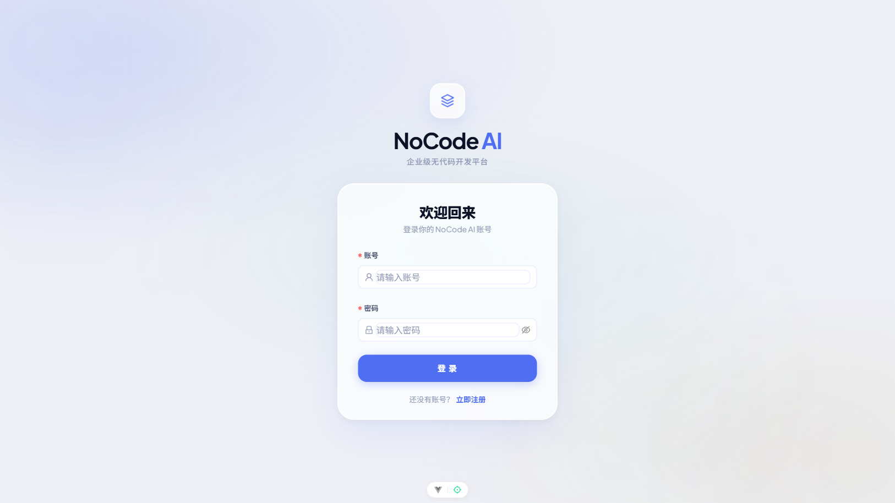
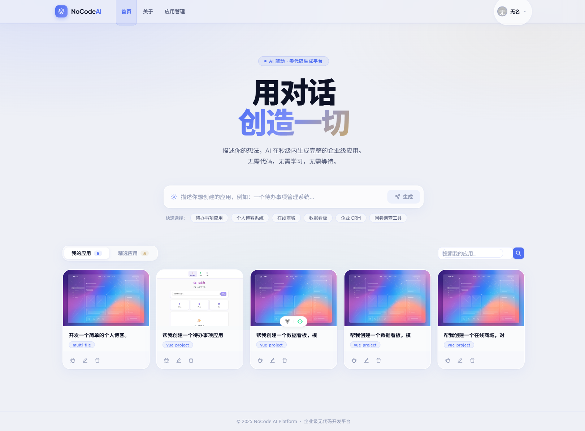
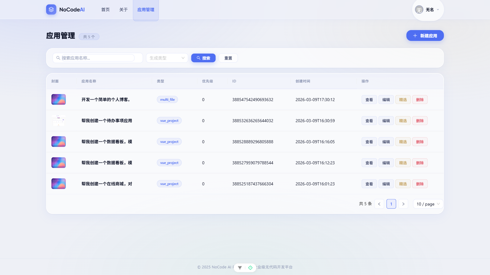
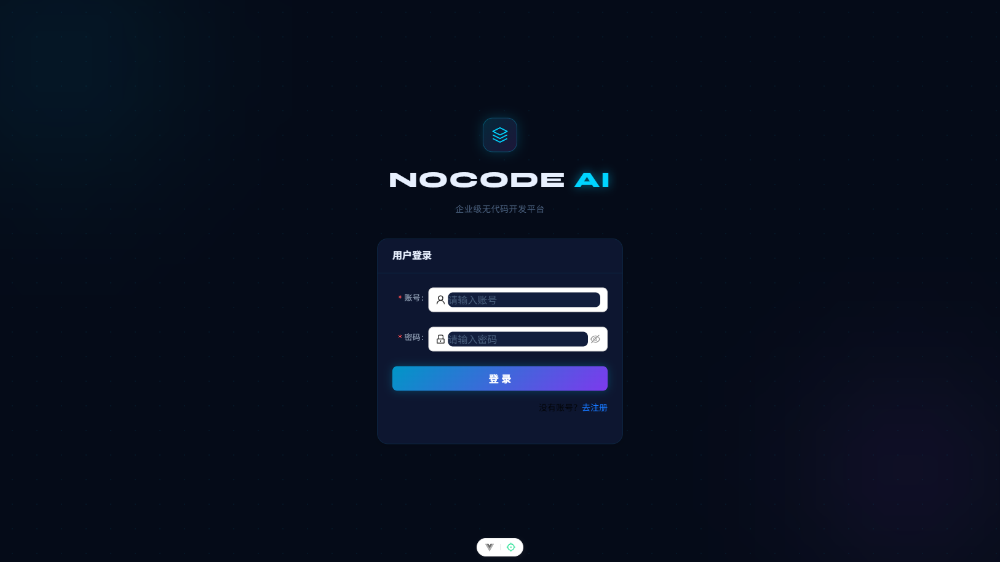
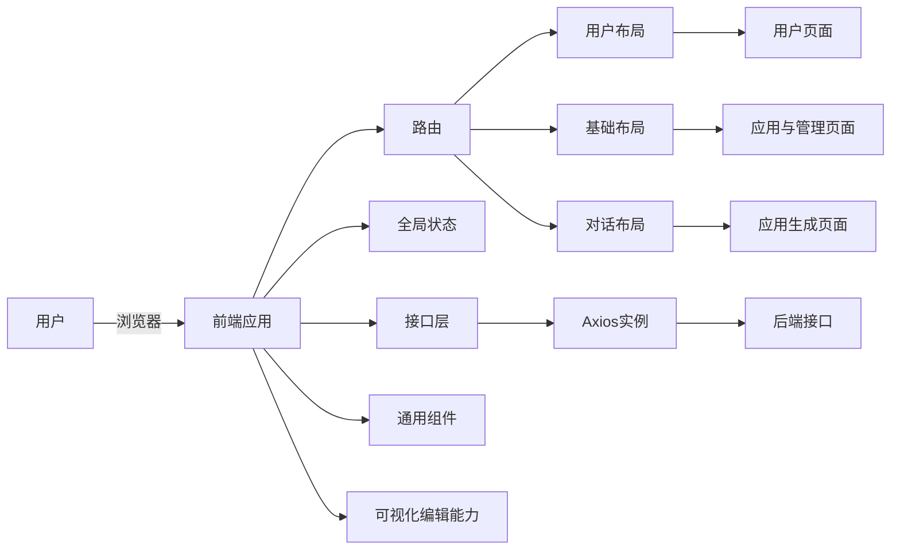
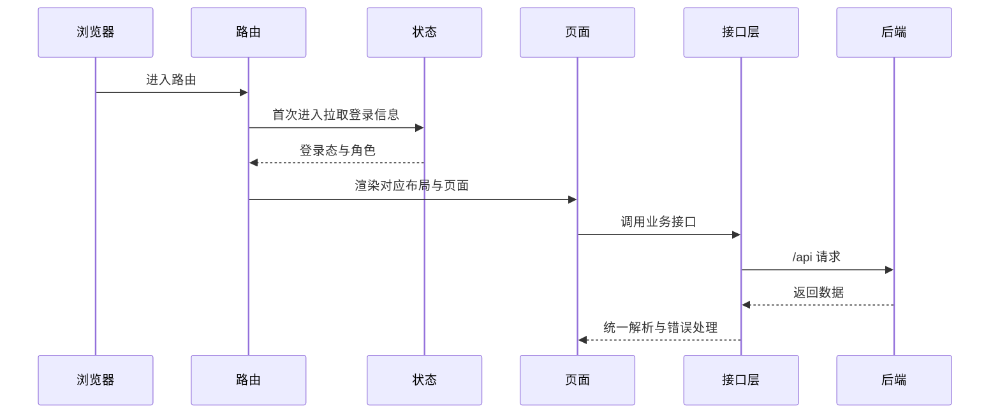
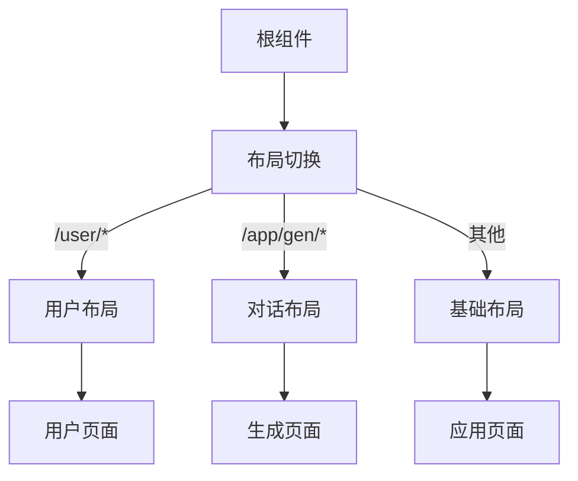

# 无代码平台前端

本项目是「无代码 AI 应用平台」的前端工程，基于 Vue 3 + Vite + TypeScript，内置多布局、路由权限、全局状态、统一 API 层与可视化编辑辅助能力。

**界面预览**






**技术栈**

- Vue 3 + TypeScript + Vite
- Vue Router
- Pinia
- Ant Design Vue
- Axios + json-bigint

**整体架构图**



**运行时流程**



**目录结构**

```text
.
├─ public/                 静态资源
├─ src/
│  ├─ api/                 业务接口聚合与类型
│  ├─ assets/              全局样式与静态资源
│  ├─ components/          通用组件
│  ├─ composables/         组合式能力（如可视化编辑）
│  ├─ layouts/             页面骨架布局
│  ├─ router/              路由与权限守卫
│  ├─ stores/              Pinia 全局状态
│  ├─ views/               页面级视图
│  ├─ App.vue              根组件，按路由切换布局
│  ├─ main.ts              应用入口
│  └─ request.ts           Axios 实例与拦截器
├─ dist/                   构建产物
└─ package.json            依赖与脚本
```

**核心模块说明**

**1) 入口与应用装配**

- `src/main.ts` 负责创建应用、挂载路由、状态与 UI 组件库。

**2) 路由与权限**

- `src/router/index.ts` 定义路由。
- `meta.access` 标识页面权限。
- `beforeEach` 中通过 `useLoginUserStore` 拉取登录态与角色。

**3) 布局体系**

- `src/App.vue` 根据路由前缀切换布局。
- `src/layouts/BasicLayout.vue` 通用页面布局。
- `src/layouts/UserLayout.vue` 登录注册等用户页面布局。
- `src/layouts/ChatLayout.vue` 应用生成类页面布局。

**4) 全局状态**

- `src/stores/useLoginUserStore.ts` 管理登录用户信息与首次拉取状态。

**5) 接口层与请求规范**

- `src/request.ts` 统一 Axios 实例，内置超时、`withCredentials`、响应与错误处理。
- 使用 `json-bigint` 避免后端返回大整数精度丢失。
- `src/api/` 下按业务划分接口与类型定义。

**6) 可视化编辑能力**

- `src/composables/useVisualEditor.ts` 提供 iframe 内元素高亮、选中、通信能力。
- 通过 `postMessage` 与宿主页面交互，支持选中元素信息回传。

**页面分层示意**



**开发与构建**

```sh
npm install
npm run dev
npm run build
npm run lint
```

**扩展建议**

- 新增页面：在 `src/views/` 添加视图组件，并在 `src/router/index.ts` 注册路由。
- 新增接口：在 `src/api/` 增加接口文件，并在 `src/api/index.ts` 统一导出。
- 新增全局状态：在 `src/stores/` 新建 store。